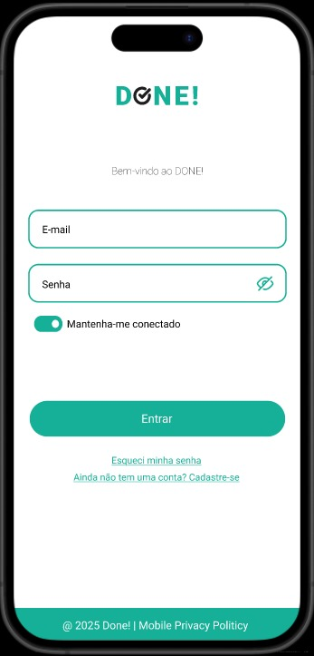
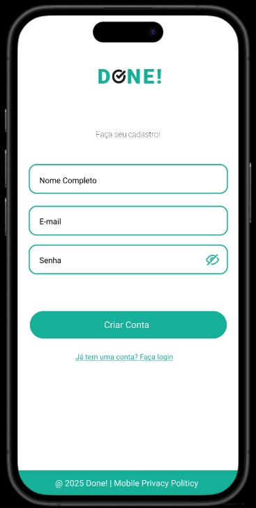
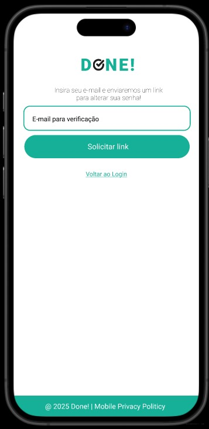
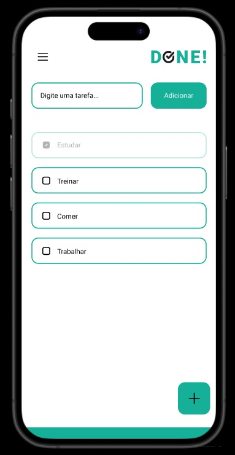
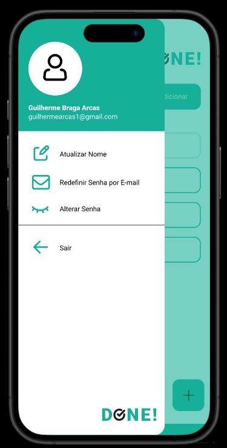

# ✅ DONE! To-Do App 

Um aplicativo de lista de tarefas (To-Do List) desenvolvido em **Flutter** e **Dart**. O objetivo é particar conceitos do desenvolvimento mobile, organização de código, integração com banco de dados (Firebase), autenticação de usuário, UI/UX e entre outros! 

## 🚀 Funcionalidades 

- Adicionar novas tarefas
- Marcar tarefas como concluídas
- Excluir tarefas com gesto de "arrastar"
- Persistência de dados local (SharedPreferences ou JSON)
- Sistema de Login e Cadastro
- Integração com Firebase
- Sistema de envio de email de verificação para redefinição de Senha
- Sistema de redefinição de nome de Usuário, redefinição de senha a partir do E-mail, e redefinição de senha a partir da senha atual a partir do CurrentUser
- Dark Mode (em desenvolvimento)

## 📱 Demonstração

## 📌 Próximos passos

- [ ] Salvar tarefas no Firebase Firestore
- [ ] Criar categorias personalizadas para as tarefas
- [ ] Melhorar interface com animações
- [ ] Dark Mode
